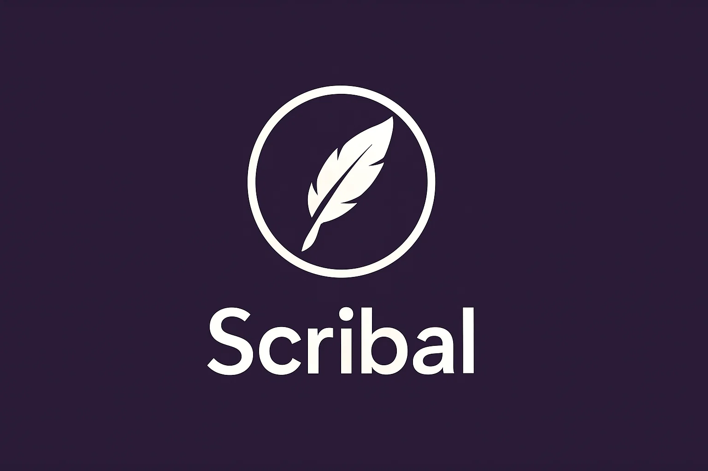

# Scribal

AI-powered fiction writing assistant for drafting and revising prose. It scans your project's markdown files to
understand your story's structure, characters, and plot, then provides contextually relevant assistance.

Made because aider isn't really meant for fiction and its repo-map feature doesn't include Markdown files.

## Features

- Analyzes your project's structure via Markdown parsing.
- Bring your own model/API key.
- Recognises special PLOT.md, STYLE.md, CHARACTERS.md files, akin to aider's CONVENTIONS.md.

## Inspiration

Scribal is indebted to [Aider](https://github.com/paul-gauthier/aider), by Paul Gauthier.

## License

MIT.
